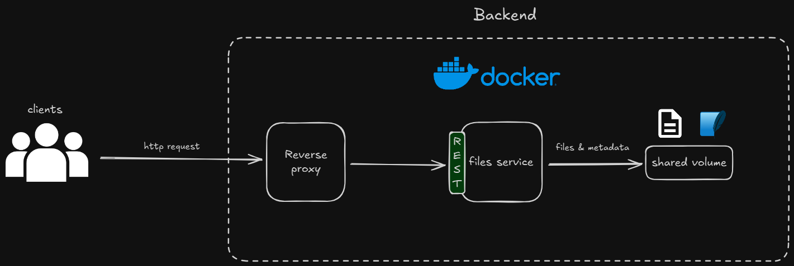

# Overview

All backend services will run in docker containers. Clients will only interact with reverse proxy which will forward requests to internal services and serve as load balancer. User files will be stored in a volume along with metadata (metada will be stored using SQLlite).

# Request Flow

When client sends a request, it will go to a reverse proxy which will forward it to files service. Depending on the user intent, files or metadata will be retrieved or saved to a shared docker volume on the host.

# Why This Architecture

This architecture is suitable for internal file management system, because it provides scalability, availability, speed, security and good developer experience. Containerization will make deploys and development easier, because docker images are immutable and versioned and developers don't have to locally install technologies to run the application. Docker also makes the backend more available (multiple instances) and easily scalable (docker compose). Reverse proxy behind the services will provide security, because it will receive all requests from clients and forward them to internal services making them unaccessible to outside world. It will also contain tls certificates and take care of load balancing, which will make developing internal services easier as they won't have to deal with that.
